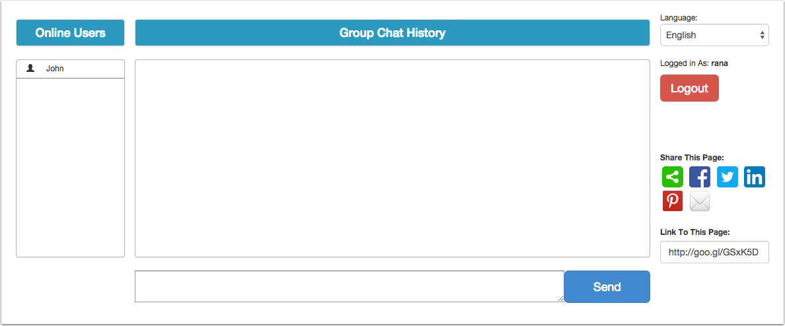
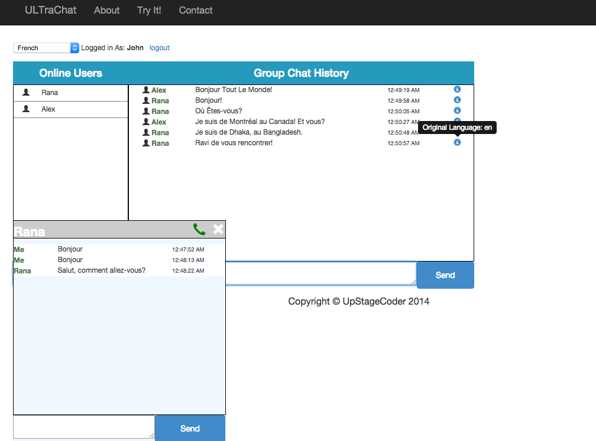
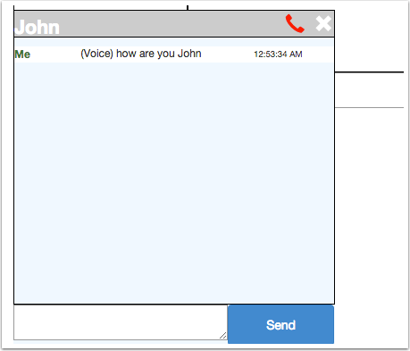

# [ULTraChat](http://urkk41752e17.ranacseruet.koding.io/ultra/)

We are team [UpStageCoder](https://github.com/koding/global.hackathon/blob/master/Teams/UpStageCoder/ABOUT.md), have choose the theme 'Challenges associated with real time communication and translation' and implemented this project as an outcome of our idea.

## Description

ULTraChat is a web based real time communication system, which allows you to communicate with people, who don't speak/understand your language.

You can text chat with anyone in the group chat room, all theirs message will be shown in your own preferred language and yours to them as their preferred language. If multiple persons message you in different languages, you will see all of them in your native(which you can select from top left select box) language!
The translation service are served by Yandex API, which supports a wide area of languages.

You can also communicate to other people(speaking different language) via voice as well. This is available in private chat system only. You can speak your own language, that will be recognized and played to your chat partner as robotic voice in his preferred language. To use this feature, first click on the username of a online user, and then click on the 'phone' icon that will appear on the top bar of private message box.

## Screenshots

## APIs/Libraries used
* [Socket.IO](http://scoket.io)
* [Yandex Translation API](http://api.yandex.com/translate/)
* [Bootstrap CSS Framework](http://getbootstrap.com/)
* [AngularJS JavaScript Framework](https://angularjs.org/)
* [HTML5 Web Speech API](https://github.com/ranacseruet/webspeech)
